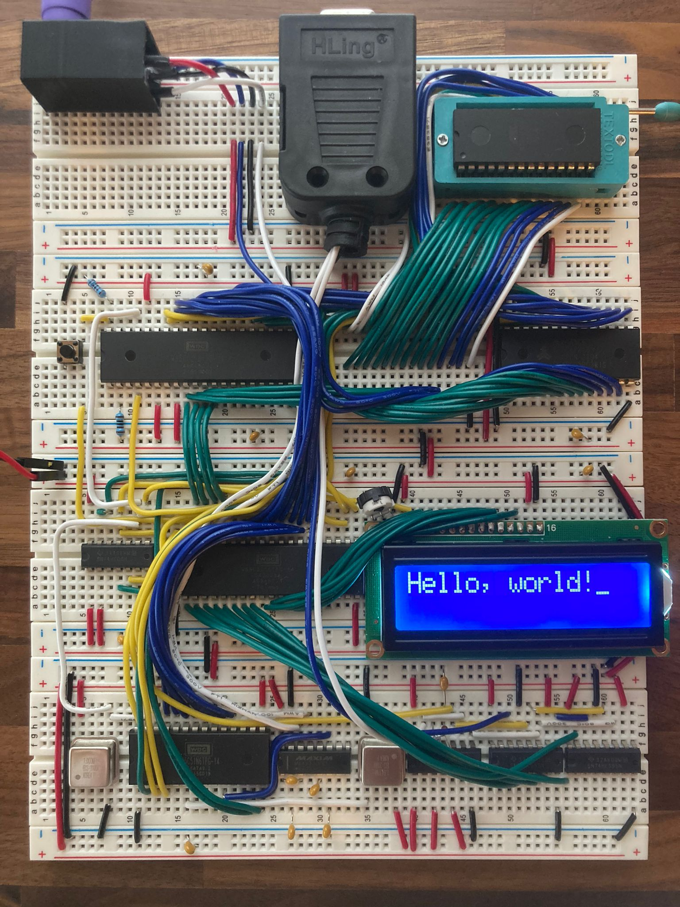

# Homemade Computer

(This is a replica of the BE65 from Ben Eater)

<figure>
    
    <figcaption><b>my homemade computer</b></figcaption>
</figure>

## The process

### Why I built it?

- I have always wondered what exactly happens in a computer, when I started writing my first programs with java it didn't really answer my questions but rather raised more questions. Then one day a video of Ben Eater was suggested to me and I was immediately enthusiastic about the idea of building a computer myself.

### Building

- So that I don't lose track of the cables, I opened the [schematics](https://eater.net/schematics/6502-serial.png) on my Ipad and marked each completed connection in green. 
- Thanks to Ben Eater's videos, I was able to understand what the individual components do during construction.

### Problems

- Get all the parts you need for the computer without spending a to much money

### Functions

- reading and display inputs of a PS2 Keyboard
- interact with a other computer by RS232

## Information about the computer

### Main components

- The processor is the [6502](https://eater.net/datasheets/w65c02s.pdf), while the [6522](https://eater.net/datasheets/w65c22.pdf) is used for I/O. The [28c256](https://eater.net/datasheets/28c256.pdf) is used as Rom and the [62256](https://eater.net/datasheets/hm62256b.pdf) as Ram.

### Memory layout

$0000 - $3fff RAM

$6000 - $600f I/O

$8000 - $ffff ROM

## Conclusion

- It was a very instructive project in terms of my understanding of computers and electronics in general. 

## Future plans

- create my own little os for the computer
- self-built gpu for the computer to be able to use it on a monitor

## Credits
All the stuff shown in this repository was created by [Ben Eater](https://www.youtube.com/beneater) and I was in no way involved in the development. 
